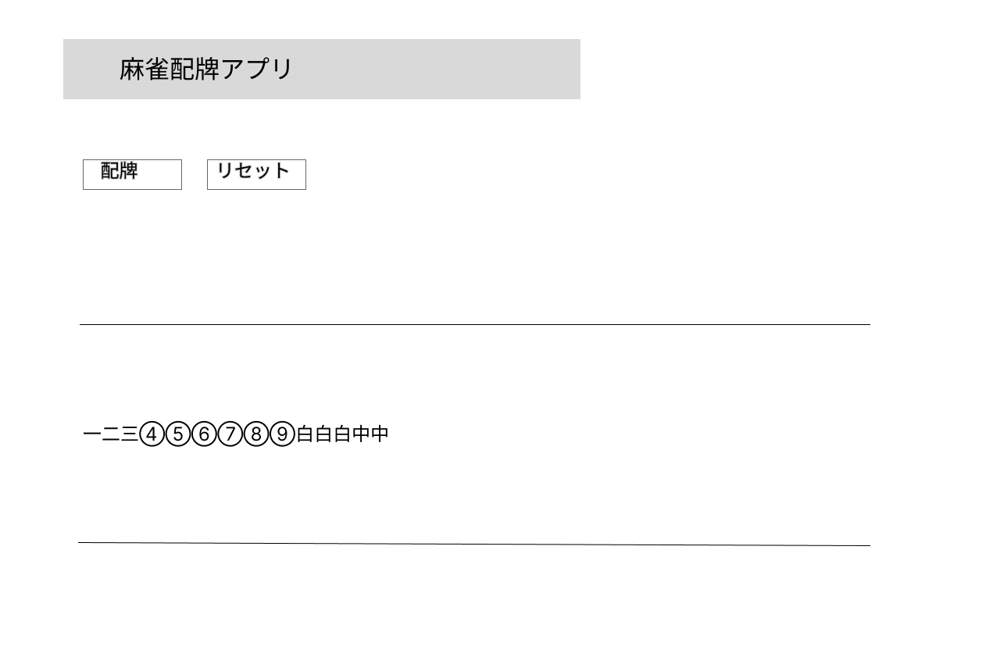

# 麻雀配牌アプリ v1.0 画面設計書

## ホーム画面

## 画面説明

| 項目           | 説明                                                      |
| -------------- | --------------------------------------------------------- |
| アプリ名       | アプリ名を表示する。                                      |
| 配牌ボタン     | 牌山136枚からランダムに14枚を取得し、手牌として表示する。 |
| リセットボタン | 表示中の手牌をクリアする。                                |
| 手牌           | 生成した手牌を表示する。                                  |
